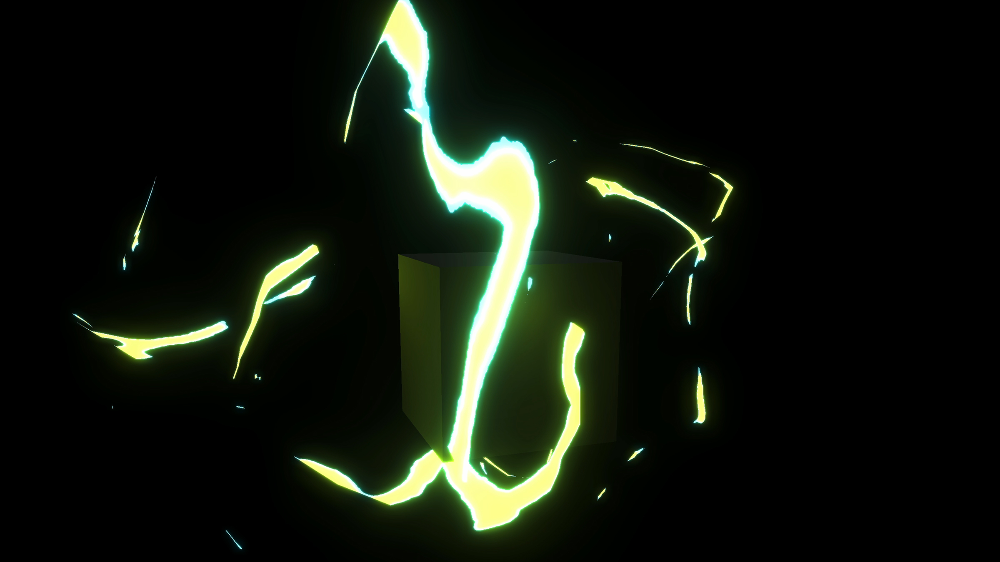
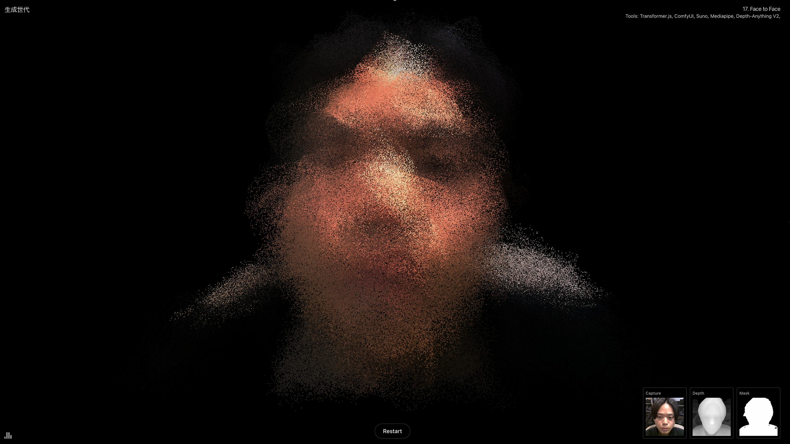
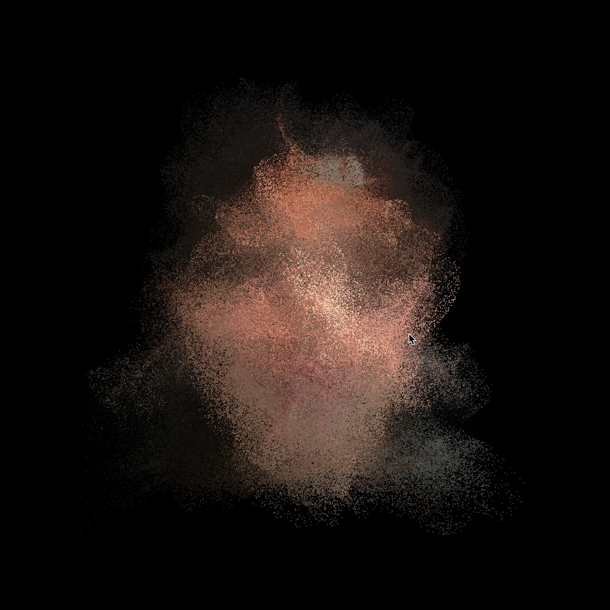
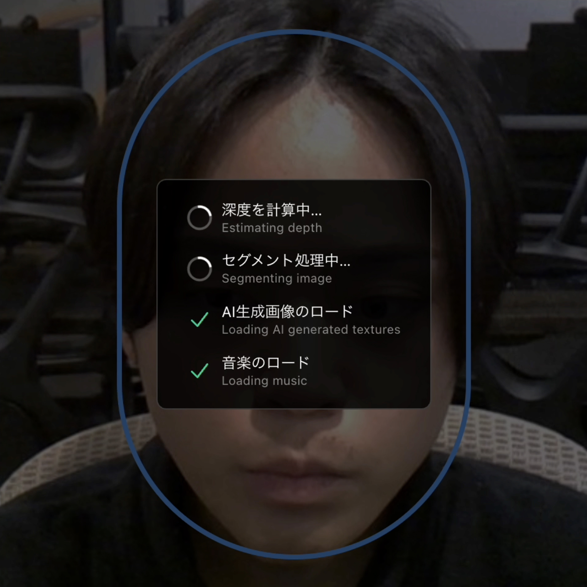

# AI時代、自分は何をつくればいいんだろう

突然ですが、みなさんはAIでつくりたいものはありますか？

よく考えてみると、これって意外と難しくないでしょうか。

AIを使えば、これまで自分ひとりではつくれなかったものもつくれそうな感じはある。けれど、じゃあ実際に何をつくりたいのかと聞かれると、うまく言葉にできない。私自身も、ずっとその「何か」を探している最中です。

今回お任せいただいた全3回の連載では、「AIで何かをつくる」という私自身の試行錯誤を、そのまま記録としてお届けしていこうと思っています。

第1回は、その出発点の話です。最近の私は、AIで何ができるのかには強く興味があるのに、肝心の「自分は何をつくりたいのか」が少し見えなくなっていました。

## 実は最近、モチベーションが下がっていました

少し個人的な話をすると、ここ最近はかなりアイデンティティクライシスのような感覚がありました。

私は普段、Webサイトの実装やデザイン、インタラクティブ表現の制作に関わっています。長い時間をかけて身につけてきたプログラミングやデザインの知識、そして3DCGやWebGLのような専門的な技術は、自分の仕事を支える大事な拠り所でした。

でも最近は、そうした拠り所が急速に揺らいでいる感じがあります。

SNSを開けば、AIでつくられた画像や映像、音楽やプログラムが次々と流れてきます。しかもその多くが、ぱっと見では人間が時間をかけてつくったものと見分けがつかないくらいの完成度です。これまで専門性が高いと思っていた領域ですら、AIのほうが速く、時には出来が良い。そんな場面に何度も出会ううちに、「自分の仕事の価値って何だろう」「自分の強みって何だったんだろう」と考えることが増えました。

こういうゲームFXのような表現も、「Unity VFX」で検索したチュートリアル動画のURLをNotebookLMでテキスト化し、AIで React / R3F に再現する工程で実現できます

それは単なる危機感というより、自信や自己効力感、自尊心のようなものが少しずつ削られていくような感覚でした。おそらく、こういう揺らぎを抱えている人は、私だけではないと思います。

## 何をつくりたいんだっけ？

もともと私は、プログラムを書くことや、クリエイティブを通して何かを生み出すことが好きでこの仕事を始めました。けれどいつの間にか、「どうつくるか」「どう効率化するか」を考える時間ばかりが増えて、「何をつくりたいのか」を考える感覚が弱くなっていた気がします。

AIの話題は、どうしてもHowに寄りがちです。どう使えば早く作れるか、どうすればコストを下げられるか、どうすれば既存の作業を置き換えられるか。もちろんそれも大切です。でも本当に大切なのは、その前にある問いではないでしょうか。

自分は何をつくりたいのか。なぜそれをつくりたいのか。
その情動を、自分の中にちゃんと持てているのか。

AIがどれだけ高性能になっても、最初に「これをつくりたい」と思うのは人間です。だからこれからの時代は、AIをうまく使えるかどうか以上に、自分の中の動機や欲望をどう育て、どう持ち続けるかが大事になるのではないかと思っています。

アイデアを考えているときや、手を動かして何かをつくっているときって、本来はすごく楽しいんですよね。その感覚を失いたくない。効率化のためだけにAIを使っていると、人はだんだん「考えること」そのものを手放してしまうのではないか。そんな怖さもあります。

だから今回は、そんな今の自分の状態をそのまま作品にしてみることにしました。

## 体験型AI生成ミュージックビデオをつくってみた

今回つくったのは、鑑賞者の顔がAI生成の人物たちと混ざり合っていく、体験型のAI生成ミュージックビデオです。

[https://seisei-sedai.vercel.app/face-to-face](https://seisei-sedai.vercel.app/face-to-face)

ウェブの体験は、どうしても「画面を見るもの」になりがちです。今回は視覚だけではなく、音も含めて体験してもらえる形にしたいと考えました。もう少し身体に近いところで受け取ってもらえる気がしたからです。

そこで、音楽と映像とインタラクションが一体になったミュージックビデオの形式を選びました。鑑賞者は画面の前で自撮りをし、その顔が画面の中で少しずつ粒子になり、AIが生成した別の人物の顔と混ざり合っていきます。

AIが当たり前になった今、私たちはただ生成物を眺めているだけではなく、自分自身もどこかでその流れの中に組み込まれているのかもしれません。今回は、そうした感覚をまず体験として立ち上げてみたいと思いました。

最近の自分が感じていた揺らぎも、この作品には自然とにじんでいる気がします。ただ、悲観だけのものにはしたくありませんでした。落ち着かなさのなかに、少しだけ別の見え方も残るような体験にしたいと思っていました。

## 技術構成をざっくり紹介します

基本の流れはとてもシンプルで、ウェブカメラで撮影した顔画像をもとに、深度マップと人物マスクをAIで生成し、その情報を使って顔を立体感のあるパーティクルとして再構成しています。そのうえで、あらかじめ用意したAI生成の顔データとモーフィングさせ、音楽のビートに合わせて揺れや変形が強くなっていく構成です。

AIまわりでは、深度推定に `onnx-community/depth-anything-v2-small` を使っています。デスクトップでは Transformers.js を使ってブラウザの Web Worker 上で推論し、モバイルでは負荷を考慮してサーバー経由で処理する構成にしています。人物の切り抜きには MediaPipe の Image Segmenter を使い、音楽は Suno で生成しました。

バックエンド側では、Next.js の API ルートを入口にしつつ、本番環境では Cloud Run 上の深度推論サービスに処理を渡しています。モバイル環境での安定性やコストも考えながら、クライアント完結できる部分とサーバー側に逃がす部分を分けているのが今回の構成上のポイントです。

## つくってみて思ったこと

この作品をつくったことで、AI時代の不安に対する明快な答えが見つかったわけではありません。

でも少なくとも、「何をつくればいいかわからない」という感覚に対して、いまの自分が本当に引っかかっているものを、一度ちゃんと形にしてみることはできました。

AIに何をさせるかを考える前に、自分は何に揺れていて、何に惹かれていて、何を怖がっているのかを見つめる。その先にようやく、「じゃあこれをつくってみたい」が立ち上がってくるのかもしれません。

第1回では、その最初の試みとして、いまの自分の揺らぎをそのまま作品にしてみた、という話を書きました。

次回以降は、今回の作品を入り口にして、AIとものづくりの関係をもう少し広く掘っていく予定です。

AIが「それっぽいもの」をどんどん作れるようになっていくなかで、人がつくる意味はどこに残るのか。第2回では、AIはどこまで人の思いやエゴを形にできるのかを実際に試しながら考えます。第3回では、その先にある問いとして、それでもWebだからこそできる表現とは何かを探ってみたいと思っています。
