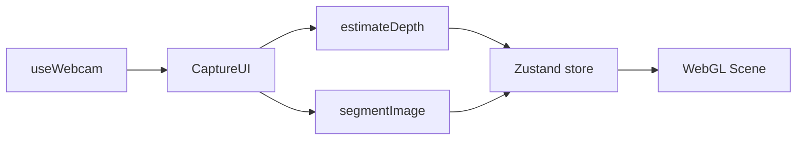

# face-to-face 構成まとめ

Web カメラで撮影した顔画像から深度マップと人物マスクを生成し、React Three Fiber で 3D 表示する作品。**デスクトップとモバイルで深度推論の実行場所を分けている**のが特徴。

---

## 1. ページとコンポーネント階層

`page.tsx` が `main` 以下に次を並べる。

| コンポーネント | 役割 |
|----------------|------|
| `WebGL/` | R3F `Canvas` + `Scene`。`Canvas` は常時マウントし `useTexture` でプリセットを先読み。**`Scene` のメッシュ表示・ビートは `selectIsExperienceLive` まで `null`**（体験前は `pointer-events-none` で下の UI を操作可）。 |
| `Title.tsx` | タイトル演出。 |
| `Loading.tsx` | ローディングオーバーレイ。撮影後〜**`selectIsExperienceLive` まで**。**`selectIsContentReady` 後にパネル内で Play**（`startExperience`）。 |
| `CaptureUI.tsx` | Start / Capture / Restart、カメラプレビュー、エラー表示（Play は Loading 内）。 |
| `Preview.tsx` | 準備完了後のプレビュー表示など。 |
| `MusicPlayer.tsx` | BGM。 |

状態の中心は **`store.ts`（Zustand）**。

---

## 2. 撮影〜処理のデータフロー

1. **`useWebcam`** … `getUserMedia` でビデオ。`captureFrame()` で正方形クロップの JPEG `Blob` と、同内容を描いた `canvas` を返す（解像度は `CAPTURE_WIDTH` / `CAPTURE_HEIGHT`）。
2. **`CaptureUI.handleCapture`** … `store.capture(imageBlob)` のあと、**並列**で  
   - `estimateDepth(imageBlob)`  
   - `segmentImage(canvas)`  
3. **`selectIsContentReady`** … 深度・マスク・音楽・プリセットが揃うと **Play ボタン表示可能**。ユーザーが Play を押すと `startExperience()` で BGM 再生（ジェスチャー連動）と `isPlaying`。  
4. **`selectIsExperienceLive`** … `selectIsContentReady && isPlaying`。WebGL のビートアニメ・`MusicPlayer` のミュート UI はここが true のとき。

---

## 3. 深度推論：デスクトップ vs モバイル

**同じモデル**（`onnx-community/depth-anything-v2-small`）を、**経路だけ分岐**。

| 環境 | 判定 | 実行場所 | 実装 |
|------|------|----------|------|
| デスクトップ | `isMobile() === false` | ブラウザ **Web Worker** | `depth-worker.ts` … Transformers.js、`webgpu` または `wasm` |
| モバイル | `isMobile() === true` | **サーバー経由** | `fetch("/api/depth")` → Vercel 上の Route Handler →（本番）**Cloud Run** |

**モバイルで Worker に寄せない理由（経緯）**

- モバイルでは ONNX/WASM のメモリ上限で**タブクラッシュ**しやすかった（解像度を下げてもモデル本体の負荷が残る）。
- デスクトップは Worker でクライアント完結でき、**Cloud Run の課金がモバイル分に抑えられる**。

**フォールバック**

- モバイルで API が失敗した場合、`createFallbackDepth`（放射状のダミー深度）に落とす。

---

## 4. バックエンド：`/api/depth` と Cloud Run

### 本番（Vercel）

- 環境変数 **`DEPTH_SERVICE_URL`**（例: `https://….run.app/depth`）と **`DEPTH_SERVICE_API_KEY`** を設定。
- `app/api/depth/route.ts` は **`@huggingface/transformers` をトップレベルで import しない**（Vercel で `onnxruntime-node` の `.so` が読み込まれてクラッシュするのを防ぐため）。
- プロキシ分岐のみ `route.ts`。ローカル推論は **`local-depth.ts` を動的 import**（`DEPTH_SERVICE_URL` 未設定時のみ）。

### Cloud Run（`depth-service/`）

- Express + multer。`POST /depth`（`multipart` フィールド `image`）、`GET /health`。
- 同一モデルで Node 上 `pipeline`（CPU）。`DEPTH_API_KEY` で `x-depth-api-key` 検証可。
- デプロイは `depth-service/scripts/deploy-cloud-run.sh` など。

### リポジトリと Vercel ビルド

- `depth-service` は **Next の `tsconfig` / ESLint / `.vercelignore` で除外**し、Vercel の `next build` 対象外（別コンテナとして GCP にデプロイ）。

---

## 5. セグメンテーション（マスク）

- **MediaPipe Image Segmenter**（`@mediapipe/tasks-vision`）、selfie モデル。
- メインスレッドで WASM 実行。`segmentImage(canvas)` が `DataTexture` とプレビュー用 `maskImageUrl` を store に格納。

深度と **同時並列**で動くため、モバイルではメモリピークに注意（必要なら直列化も検討余地あり）。

---

## 6. 状態（Zustand）の要点

- `imageTexture` / `depthTexture` / `maskTexture` … Three.js 用。
- `capturedImageUrl` / `depthImageUrl` / `maskImageUrl` … UI プレビュー用。
- `isDepthLoading` / `isSegmentLoading` / `isMusicLoading` / `isPresetsLoading` … Loading 表示と `selectIsContentReady`。  
- `isPlaying` … Play タップ後の体験中。Restart / 再 Capture で false。
- `error` … 深度などの失敗メッセージ。

---

## 7. 環境変数一覧（参照用）

| 変数 | 置き場 | 用途 |
|------|--------|------|
| `DEPTH_SERVICE_URL` | Vercel Production | Cloud Run の `https://…/depth` |
| `DEPTH_SERVICE_API_KEY` | Vercel | プロキシが付与する `x-depth-api-key` |
| `DEPTH_API_KEY` | Cloud Run コンテナ | 上と同値で検証 |
| ローカル検証 | `.env.local` | 上記 2 つ + 手元 `depth-service` の `DEPTH_API_KEY` を揃える |

---

## 8. 運用・コストのメモ

- **課金の主因はモバイル 1 Capture あたりの Cloud Run 呼び出し**（処理秒数・メモリ設定に依存）。
- GCP の **予算アラートは通知が主**で、超過で自動停止はしない。**手動で Cloud Run サービス削除**などで止める。
- 詳細は `depth-service/README.md` および GCP コンソール（請求・Cloud Run）。

---

## 9. 主要ファイル索引

| パス | 内容 |
|------|------|
| `page.tsx` | レイアウト組み立て |
| `store.ts` | 深度・マスク・テクスチャ・ローディング |
| `useWebcam.ts` | カメラ・キャプチャ解像度 |
| `CaptureUI.tsx` | UI・Capture 時の `Promise.all` |
| `depth-worker.ts` | デスクトップ用深度 Worker |
| `app/api/depth/route.ts` | プロキシ or 動的 import 分岐 |
| `app/api/depth/local-depth.ts` | ローカル専用 Transformers 推論 |
| `depth-service/` | Cloud Run 用 Node サービス |

---

*最終更新: 構成整理・Cloud Run 連携・Vercel プロキシ分離を反映*
